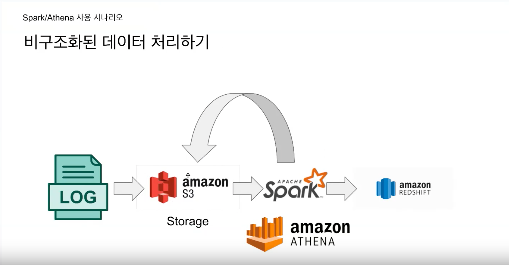

# 3주차 ETL 과 Airflow 

## 지난 주 숙제 리뷰 및 질분  

Redshift 는 기본적으로 하루치~36일치의 데이터를 백업해준다. 

그래서 데이터를 비교하기도 한다. 

SQL 중에서 INTERSECT 를 통해서 두 개의 테이블을 비교를 해서 데이터의 집합을 비교하기도 한다. 

### 숙제 2) 사용자 별로 처음/마지막 채널 알아내기

SQL 에서 first_value 와 last_value 를 사용해보는 것이 숙제였음.

### FIRST_VALUE 
- 윈도우 함수 중 하나로 주어진 윈도우 내에서 첫 번째 값을 반환할 때 쓰임. 
- 결과 집합 중 특정 기준에 대한 첫 번째 행을 반환할 때.

예제도 살펴보자. 

Sales 스키마 가정 

```sql
sales(
  customer_id INT,
  purchase_date DATE,
  amount DECIMAL
)
```

예시 데이터 셋 설정 

```sql
INSERT INTO sales (customer_id, purchase_date, amount) VALUES
(1, '2022-01-01', 50),
(1, '2022-01-15', 30),
(1, '2022-02-01', 25),
(2, '2022-01-05', 40),
(2, '2022-01-20', 80),
(3, '2022-01-10', 100);
```

FIRST_VALUE 를 포함한 쿼리 

```sql
SELECT
  customer_id,
  purchase_date,
  amount,
  FIRST_VALUE(amount) OVER (
    PARTITION BY customer_id
    ORDER BY purchase_date DESC
    ROWS BETWEEN UNBOUNDED PRECEDING AND UNBOUNDED FOLLOWING
  ) AS most_recent_purchase
FROM
  sales;
```

- 고객별로 (customer_id) 파티션을 나눈다.
- 그리고 purchase_date 를 내림차순한다.
- FIRST_VALUE(amount) 를 통해서 그때의 구매 금액을 가져온다. 
- ROWS BETWEEN UNBOUNDED PRECEDING AND UNBOUNDED FOLLOWING 를 통해서 윈도우 범위를 지정한다. 
  - 여기서는 윈도우 함수가 파티션 내 모든 행을 포함하도록 지정하는 것 
  - UNBOUNDED PRECEDING 은 현재 행보다 앞에 있는 행들을 포함하는 것.
  - UNBOUNDED FOLLOWING 는 현재 행보다 뒤에 있는 행들을 포함하는 것.

결과 출력 

```yaml
customer_id | purchase_date | amount | most_recent_purchase
-------------+---------------+--------+---------------------
           1 |    2022-01-01 |     50 |                  25
           1 |    2022-01-15 |     30 |                  25
           1 |    2022-02-01 |     25 |                  25
           2 |    2022-01-05 |     40 |                  80
           2 |    2022-01-20 |     80 |                  80
           3 |    2022-01-10 |    100 |                 100
```

- 고객별로 가장 최근의 금액이 most_recent_purchase 에 나타난다.


## Spark 사용 시나리오 


1) spark 으로 모델에 입력으로 들어가는 feature 를 배치로 미리 계산해놓고 NoSQL 에 저장해둔다. 그 다음 사용자가 들어오면 해당 NoSQL 에 있는 데이터를 바탕으로 모델이 추론함.



2) Spark 을 통해서 비구조화된 데이터를 구조화해서 데이터 웨어하우스에 적재. 


## 용어 설명 

- 데이터 레이크 
  - 데이터 웨어하우스보다 스케일이 더 큰 것. 
  - 구조화된 데이터 + 비구조화된 데이터까지 있는 것.
  - 모든 데이터를 원형대로 보존.
- 데이터 웨어하우스 
  - 보존기관이 있는 데이터고 구조화된 데이터를 저장.
- 데이터 파이프라인 
  - source 로 부터 목적지까지 데이터를 복사하는 작업
  - 목적지는 데이터 웨어하우스만 있는 것도 아님. 프로덕션 데이터베이스나 캐시도 됨.

### 데이터 파이프라인 종류 

1) 외부와 내부에서 데이터를 API 와 같은 것들을 통해서 읽은 후 적당한 데이터로 포맷을 변환해서 데이터 웨어하우스 같은 곳에 로드하는 것. 

- 이 작업은 보통 데이터 엔지니어가 한다.

2) 데이터 웨어하우스에서 ELT 를 해서 요약 테이블을 만들고 다시 데이터 웨어하우스에 쓰는 것.
- Raw 데이터를 읽어서 요약해서 다시 기록하는 것이다.
- 특수한 형태로는 A/B 테스트 결과를 분석하는 파이프라인도 있다.

3) 데이터 웨어하우스에서 읽어서 다른 Storage (많은 경우 프로덕션 DB) 로 쓰는 ETL

- 조회수 같은 경우는 실시간으로 업데이트 하는 경우가 아니라 배치식으로 한번에 업데이트 하는 것

## 실습) 파이썬으로 ETL 만들기 

여기서는 데이터 적재하는 부분으로 INSERT INTO 로 단건식 넣고 있었는데 이러면 100만건의 데이터의 경우 100만건의 INSERT 가 필요하다.  
- 이렇게 하는 경우에는 ETL 이 여러번 실행하면 여러번 데이터가 들어가서 데이터 중복이 생긴다. 
- 데이터를 넣다가 실패하는 경우도 생각해야한다.  
- Source 와 DW (데이터 웨어하우스) 와 똑같아야한다. 이를 고민해야함.

그래서 주로 파일 하나로 만들어서 파일을 S3 에 올리고 그런 식으로 한다. 그 다음 S3 에 있는 파일을 COPY SQL 를 통해서 bulk insert 를 한다.

## Airflow 소개 

가장 많이 사용되는 데이터 파이프라인 관리/구현 프레임워크

데이터 파이프라인 프레임워크 

Airflow 는 총 5개의 컴포넌트로 구성된다. 
- Web Server (flask)
- Scheduler 
  - 정해진 시간에 트리거되거나 데이터 파이프라인이 끝나면 특정 데이터 파이프라인을 트리거하거나
  - job 을 실행하는 역할을 한다.
- Worker 
  - 서버의 수를 말한다. 
  - 스케일아웃을 하면 worker 가 늘어난다.
  - k8s 를 쓴다면 또 달라짐 
- Database (sqlite 가 기본.)
- Queue (멀티노드 구성인 경우에 사용됨.)
  - 이 경우 Executor 가 달라진다.


DAG 같은 경우는 테스크가 일렬로 (t1 -> t2 -> t3) 로 실행될 수도 있지만 아닐 수도 있다. (t1 -> t2,t3) 

모든 task 에 필요한 정보들 
- default args 
  - owner
  - start_date
  - end_date
  - email
  - retries
  - retry_delay 

모든 DAG 에 필요한 정보들 
- dag name 
- schedule
- tags
- default args

#### Operator Creation Example


- operator 가 task 이다.
- t1 >> t2, t1 >> t3 or t1 >> [t2, t3] 이게 task 연결을 맺는 문법이다.


#### 중요한 것들 정리 

- Airflow 에서 데이터 파이프라인은 DAG 로 구성되며 DAG 는 task 들의 연결로 구성된다. task 는 Airflow 의 operator 로 만들어진다.
  - airflow 에는 다양한 operator 를 지원한다. 필요하다면 operator 를 만들 수 있다.

## 데이터 파이프라인을 만들 때 고려할 점

데이터 파이프라인도 코드이다.
- 버그를 고려해야한다. 
- 데이터 소스의 문제도 있을 수 있다 (포맷이 달라지거도 한다). 이것 때문에 버그가 만들어질 수 있음.
- 삭제할 때 데이터 파이프라인들의 의존도를 고려해야한다. 데이터 파이프라인들간의 의존도를 이해 못해서 잘못된 삭제를 하는 경우도 있다. 

데이터 파이프라인이 늘어나면 유지보수가 커진다.
- 그리고 의존관계가 생기면서 하나가 돌지 않으면 연쇄적인 효과가 나옴.
  - 데이터 파이프라인의 개수를 늘리는 건 유지보수 비용이 꽤 크다는 뜻 같다. 

### Best Practices

- 가능하다면 데이터가 작다면 통째로 복사하자. (full refresh 라고 부른다.)
  - 트랜잭션을 적용해야한다. 불완전한 상태가 되지 않도록.

- incremental update 가 가능하다면 이를 적용하기 전에 몇가지 조건이 있다.
  - 데이터 소스가 프로덕션 데이터베이스라면 다음 필드가 필요하다. 
    - created
    - modified
    - deleted
  - 데이터 소스 API 가 특정 날짜를 기준으로 생성되거나 업데이트된 레코드들을 가지고 올 수 있어야함.
  - incremental update 는 놓치면 안된다. 놓친 증분이 있다면 다시 채워넣을 수 있는 Backfill 기능이 있어야한다.  

- 멱등성 (idempotency) 을 보장해야한다. 
  - 멱등성이란 여러번 실행해도 결과가 같은 것을 말한다.

- 실패한 데이터 파이프라인을 재실행하기 쉬워야한다.
- 과거 데이터를 다시 채우는 (backfill) 이 쉬워야한다.
  - 과거의 데이터가 잘못되서 다시 채워야하는 경우를 말함.
- Airflow 는 특히 backfill 에 강하다.

- 데이터 파이프라인의 입력과 출력을 문서화하고 명확히 해야한다. 

- 주기적으로 쓸모없는 데이터들을 지워야한다. 

- 데이터 파이프라인 사고마다 사고 레포트를 써야한다.

- 중요한 데이터 파이프라인의 입력과 출력을 확인해봐야한다. 
  - summary 테이블을 만들어내고 primary key 의 unique 함이 보장되는지
  - 중복되는 데이터와 레코드가 있는지
  - 입력 레코드의 수와 출력 레코드의 수를 확인해보는 것.


## Airflow 의 Backfill 방식 설명 

Airflow 를 사용하는 이유 자체는 backfill 때문이다. 이게 어렵다면 데이터 엔지니어의 삶이 고달플 것.

예제를 통해서 이해해보자 

- 예를 들어서 2020 년 11월 7일의 데이터부터 매일 읽어오는 프로그램을 만든다고 가정해보자. (이걸 Daily Incremental update 라고 한다.)
- 그럼 처음 시작은 2020년 11월 8일이 되겠지. 7일에 데이터가 다 쌓여야하니까.
  - Airflow 의 경우 여기서 `start_date` 의 날짜는 11월 7일로 설정해야한다. 11월 7일의 데이터를 읽을거니까. 
    - `start_date` 는 처음 시작하는 날짜가 말하는게 아님. 처음 읽어와야하는 데이터임.
    - 즉 매일 실행하는 거라면 start_date 의 다음날 실행되고, 매일 한시간마다 실행되는거라면 그 다음 시간에 실행되는거임. 
    - 이 이유로는 Airflow 는 Incremental update 를 한다고 가정하기 때문에.

- 2020-08-10 02:00:00 을 start_date 로 설정하고 이 job 을 2020-08-13 21:00:00 에 활성화되었다고 가정해보자. 
  - 기본적으로 airflow 는 catchup 파라미터가 true 이다. 그래서 현재 시간과 start_date 사이에 놓친 job 이 있다면 실행된다. 
  - 즉 start_date 가 과거이므로 실행되어야 했는데 안되었으니까 이것들이 실행된다. 
    - 2020-08-10 02:00:00, 2020-08-11 02:00:00, 2020-08-12 02:00:00, 2020-08-13 02:00:00 의 Job 이 실행된다.

- 지난 과거의 1년 데이터가 잘못되었다는 걸 알아서 다시 backfill 해야한다면 어떻게 하면 될까?
  - 보통 데이터 엔지니어들은 읽어야 하는 날짜의 데이터를 현재 시점을 기준으로 계산때린다.
    - `datetime.now() - time`
  - 읽어와야 하는 날짜를 계산해서 하는게 아니라 읽어와야 하는 날짜의 데이터를 DAG 의 execution_date 에 명시하면 된다. 읽어와야하는 날짜를 다 Airflow 에게 맡긴다. 그럼 지난 과거의 날짜를 다 명시하면 됨. 
    - (증분을 놓치는 경우를 생각해보자. 증분은 놓치면 안된다.) 
  