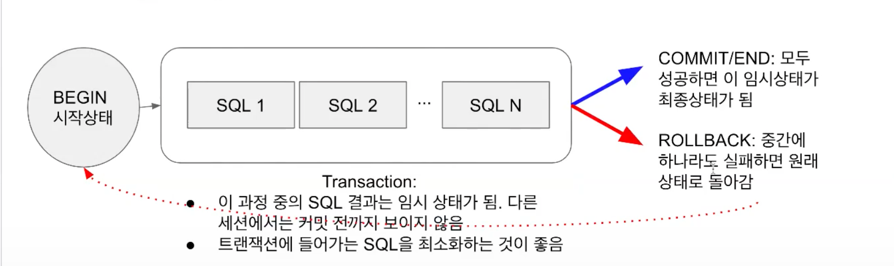

# 4주차 Airflow DeepDive 

## 질문 리뷰 

#### Q1) 멱등성이 무엇인가 

- Source 에 있는 data 가 missing 된 것이나 duplicate 된 게 없어야한다. 

#### Q2) Full Refresh 의 경우 해결해야하는 문제는 이렇다.

- 데이터 테이블을 삭제했는데 접근하는 경우.
- 데이터를 로드하고 있는데 접근하는 경우. 

이 경우의 문제를 해결하기 위해선 트랜잭션을 적용해야한다.

아니면 접근하는 경우를 제어하던가.

#### Q3) 하루동안 데이터가 쌓이고 이것들에 대한 처리를 00:00:00 으로 하는게 아니라 약간의 마진을 두고 시작하고 싶다. 딜레이를 줘서. 이런 경우는 어떻게 하는가? 

- start_date 를 바탕으로 DAG 의 트리거링이 시작될텓데 이것보다 좀 더 마진을 주고 싶다면 schedule 을 걸면 된다. 
- DAG 의 트리거링은 `start_date` 와 `schedule_interval` 을 바탕으로 시작된다. 
  - start_date 를 2022 년 1월 1일 이고 schedule_interval 이 10 * * * * 이라면 매일 0시 10분에 시작된다.
  - `schedule_interval` 을 명시하지 않으면 once 로 처리되서 한번만 실행된다.
  - 데이터 파이프라인이 실행되면 해당 읽어야 할 데이터의 시간이 `execution_date` 에 들어가게 된다. 

#### Python Airflow Example code 

```python
from airflow import DAG
from airflow.operators.python import PythonOperator
from datetime import datetime
import requests
import logging
import psycopg2

def get_Redshift_connection():
    host = "learnde.cduaw970ssvt.ap-northeast-2.redshift.amazonaws.com"
    user = "keeyong"  # 본인 ID 사용
    password = "..."  # 본인 Password 사용
    port = 5439
    dbname = "dev"
    conn = psycopg2.connect(f"dbname={dbname} user={user} host={host} password={password} port={port}")
    conn.set_session(autocommit=True)
    return conn.cursor()


def extract(url):
    logging.info("Extract started")
    f = requests.get(url)
    logging.info("Extract done")
    return (f.text)


def transform(text):
    logging.info("transform started")
    # ignore the first line - header
    lines = text.split("\n")[1:]
    logging.info("transform done")
    return lines


def load(lines):
    logging.info("load started")
    cur = get_Redshift_connection()
    sql = "BEGIN;DELETE FROM keeyong.name_gender;"
    for l in lines:
        if l != '':
            (name, gender) = l.split(",")
            sql += f"INSERT INTO keeyong.name_gender VALUES ('{name}', '{gender}');"
    sql += "END;"
    cur.execute(sql)
    logging.info(sql)
    logging.info("load done")


def etl():
    link = "https://s3-geospatial.s3-us-west-2.amazonaws.com/name_gender.csv"
    data = extract(link)
    lines = transform(data)
    load(lines)


dag_second_assignment = DAG(
	dag_id = 'name_gender',
	catchup = False,
	start_date = datetime(2023,4,6), # 날짜가 미래인 경우 실행이 안됨
	schedule = '0 2 * * *')  # 적당히 조절

task = PythonOperator(
	task_id = 'perform_etl',
	python_callable = etl,
	dag = dag_second_assignment)
```

#### Q4) DELETE FROM ve TRUNCATE

- DELETE FROM 은 조건에 맞는 레코드를 삭제. 트랜잭션 적용가능.
- TRUNCATE 는 전체를 삭제. 그리고 트랜잭션 무시.  

## 트랜잭션이란? 



정의는 이렇다. **Atomic 하게 실행되야 하는 SQL 을 한번에 실행하는 방법**
- 적용하려면 `BEGIN` 과 `END` 사이 혹은 `BEGIN` 과 `COMMIT` 사이에 해당 SQL 문들을 넣어야한다.

트랜잭션을 쓸 때 auto commit 여부가 중요하다.
- 기본적으로 auto commit 은 활성화 되어 있으며 각각의 SQL 문은 바로바로 커밋된다. 
  - 이를 바꾸고 싶다면 `BEGIN` `END` 혹은 `BEGIN` `COMMIT` 을 해야한다.
- auto commit 을 하지 않는다면 기본적으로 SQL 문은 바로바로 커밋되지 않는다. 명시적으로 `commit` 이나 `rollback` 을 수동적으로 호출해줘야한다.
- 여러개의 데이터베이스에 작업을 할 땐 개별적으로 롤백을 해야할 수 있으므로 이 경우에는 auto commit 을 하지 않는게 더 나을 수 있다고 한다. 

```python
try:
  cur.execute("BEGIN;")
  cur.execute("DELETE FROM keeyong.name_gender;") 
  cur.execute("INSERT INTO keeyong.name_gender VALUES ('Claire', 'Female');")
  cur.execute("END;")
except (Exception, psycopg2.DatabaseError) as error:
  cur.execute("ROLLBACK;")
  raise
finally :
  conn.close()
```

- 실패했을 경우에 명확하게 ROLLBACK 호출해주는 예시.
- 데이터 엔지니어의 좋은 마인드셋은 실패했을 때 깔끔하게 돌려놓는게 좋다. (물론 그게 상관없는 데이터들도 있다.)
  - 정합성이 중요한 데이터들을 다룰 때.
- **여기서 또 중요한 건 catch 로 예외를 전파한 후 발생한 예외를 raise 해서 발생한 예외를 개발자들이 볼 수 있도록 해야한다.**  

### Auto commit 

MySQL 기준으로 모든 user 의 activity 는 트랜잭션 내애서 발생한다. 그리고 connection 에서 session 이 시작되면 기본적으로 auto commit 이 enabled 가 되어있음.

그리고 각각의 sql 문 자체가 transaction 으로 되어있음.
- 그래서 그냥 각각의 SQL 문마다 `START TRANSACTIOn`, `END` 로 둘러쌓여있는 것과 같음.
- 이게 싫다면, 즉 여러 SQL 문을 트랜잭션으로 하고 싶다면 `START TRANSACTION` or `BEGIN` 으로 시작해야한다. auto commit 모두가 활성화된 상태에서도 이게 가능함.

**커밋을 한다는 것 자체는 다른 세션에서 이제 이 변화를 볼 수 있다는 것임.** 
- 그리고 commit 과 rollback 은 innodb 의 모든 lock 을 release 한다.


**커넥션을 가지고올 때 auto commit 을 false 로 해야함.**

## Airflow 설치 


- AWS EC2, Ubuntu 20.04 기준 
- Airflow Meta 데이터베이스로 postgresql 로 설정 
- Airflow 는 /var/lib/airflow 밑에 설치된다. 
- Airflow 서버에 총 3개의 어카운트가 사용된다. 
  - ubuntu: 메인 어카운트 
  - postgres: postgres 접근을 위해서 airflow 가 별도로 생성함. 
  - airflow: airflow 실행을 위한 어카운트 
- 권한은 필요한 권한만 주도록 해야한다.

- 버전 같은 경우는 메이저 대기업에서 적용하는 버전을 보고 그거 적용.

## Airflow 로 DAG 실행하기 

```python
from airflow import DAG
from airflow.operators.python import PythonOperator
from datetime import datetime

dag = DAG(
    dag_id = 'HelloWorld',
    start_date = datetime(2022,5,5),
    catchup=False,
    tags=['example'],
    schedule = '0 2 * * *')

def print_hello():
    print("hello!")
    return "hello!"

def print_goodbye():
    print("goodbye!")
    return "goodbye!"

print_hello = PythonOperator(
    task_id = 'print_hello',
    #python_callable param points to the function you want to run 
    python_callable = print_hello,
    #dag param points to the DAG that this task is a part of
    dag = dag)

print_goodbye = PythonOperator(
    task_id = 'print_goodbye',
    python_callable = print_goodbye,
    dag = dag)

#Assign the order of the tasks in our DAG
print_hello >> print_goodbye
```

- python 코드로 DAG 실행하기. 
- python 함수 하나가 Task 로 되도록 했다.  
- print_hello 실행된 다음에 print_goodbye 가 실행된다.

#### 터미널에서 DAG 실행 


### 중요한 태그 파라미터 

- `max_active_runs`: 한번에 실행될 수 있는 최대 dag instance 의 수 
  - full refresh 를 하는 경우에는 1로 설정되야함.
- `max_active_tasks`: 한번에 실행될 수 있는 테스크의 수. (병렬성) 
- `catchup`: 과거의 실행되야 할 dag 를 놓친 경우에 backfill 을 할건지의 여부.

### Operator 


- 가장 기본적인 python operator. 파이썬 함수 하나로 결정.
- cxt 파라미터에 airflow 에서 task 에 필요한 정보들을 넣어준다.

## 실습) NameGender 파이프라인 개선 

#### AS-IS

```python
from airflow import DAG
from airflow.operators.python import PythonOperator
from datetime import datetime
import requests
import logging
import psycopg2

def get_Redshift_connection():
    host = "learnde.cduaw970ssvt.ap-northeast-2.redshift.amazonaws.com"
    user = "keeyong"  # 본인 ID 사용
    password = "..."  # 본인 Password 사용
    port = 5439
    dbname = "dev"
    conn = psycopg2.connect(f"dbname={dbname} user={user} host={host} password={password} port={port}")
    conn.set_session(autocommit=True)
    return conn.cursor()


def extract(url):
    logging.info("Extract started")
    f = requests.get(url)
    logging.info("Extract done")
    return (f.text)


def transform(text):
    logging.info("transform started")
    # ignore the first line - header
    lines = text.split("\n")[1:]
    logging.info("transform done")
    return lines


def load(lines):
    logging.info("load started")
    cur = get_Redshift_connection()
    sql = "BEGIN;DELETE FROM keeyong.name_gender;"
    for l in lines:
        if l != '':
            (name, gender) = l.split(",")
            sql += f"INSERT INTO keeyong.name_gender VALUES ('{name}', '{gender}');"
    sql += "END;"
    cur.execute(sql)
    logging.info(sql)
    logging.info("load done")


def etl():
    link = "https://s3-geospatial.s3-us-west-2.amazonaws.com/name_gender.csv"
    data = extract(link)
    lines = transform(data)
    load(lines)


dag_second_assignment = DAG(
	dag_id = 'name_gender',
	catchup = False,
	start_date = datetime(2023,4,6), # 날짜가 미래인 경우 실행이 안됨
	schedule = '0 2 * * *')  # 적당히 조절

task = PythonOperator(
	task_id = 'perform_etl',
	python_callable = etl,
	dag = dag_second_assignment)
```

#### 개선 1) 

- params 를 통해서 변수 넘기기
- execution_date 얻기 
- delete from vs truncate 

```python
from airflow import DAG
from airflow.operators.python import PythonOperator
# from airflow.operators import PythonOperator
from airflow.models import Variable

from datetime import datetime
from datetime import timedelta
import requests
import logging
import psycopg2


def get_Redshift_connection():
    host = "learnde.cduaw970ssvt.ap-northeast-2.redshift.amazonaws.com"
    redshift_user = "keeyong"  # 본인 ID 사용
    redshift_pass = "..."  # 본인 Password 사용
    port = 5439
    dbname = "dev"
    conn = psycopg2.connect(f"dbname={dbname} user={redshift_user} host={host} password={redshift_pass} port={port}")
    conn.set_session(autocommit=True)
    return conn.cursor()


def extract(url):
    logging.info("Extract started")
    f = requests.get(url)
    logging.info("Extract done")
    return (f.text)


def transform(text):
    logging.info("transform started")
    # ignore the first line - header
    lines = text.split("\n")[1:]
    logging.info("transform done")
    return lines


def load(lines):
    logging.info("load started")
    cur = get_Redshift_connection()
    sql = "BEGIN;DELETE FROM keeyong.name_gender;"
    for l in lines:
        if l != '':
            (name, gender) = l.split(",")
            sql += f"INSERT INTO keeyong.name_gender VALUES ('{name}', '{gender}');"
    sql += "END;"
    logging.info(sql)
    """
    Do we want to enclose try/catch here
    """
    cur.execute(sql)
    logging.info("load done")


def etl(**context):
    link = context["params"]["url"]
    # task 자체에 대한 정보 (일부는 DAG의 정보가 되기도 함)를 읽고 싶다면 context['task_instance'] 혹은 context['ti']를 통해 가능
    # https://airflow.readthedocs.io/en/latest/_api/airflow/models/taskinstance/index.html#airflow.models.TaskInstance
    task_instance = context['task_instance']
    execution_date = context['execution_date']

    logging.info(execution_date)

    data = extract(link)
    lines = transform(data)
    load(lines)


dag_second_assignment = DAG(
    dag_id = 'name_gender_v2',
    start_date = datetime(2023,4,6), # 날짜가 미래인 경우 실행이 안됨
    schedule = '0 2 * * *',  # 적당히 조절
    catchup = False,
    max_active_runs = 1,	
    default_args = {
        'retries': 1,
        'retry_delay': timedelta(minutes=3),
    }
)


task = PythonOperator(
	task_id = 'perform_etl',
	python_callable = etl,
        params = {
            'url': "https://s3-geospatial.s3-us-west-2.amazonaws.com/name_gender.csv"
        },
	dag = dag_second_assignment)
```

#### 개선 2) 

- 세개의 함수를 테스크로 나누기 
- 하드코딩 된 정보를 airflow 의 variable 로 읽어오기

```python
from airflow import DAG
from airflow.operators.python import PythonOperator
from airflow.models import Variable

from datetime import datetime
from datetime import timedelta
import requests
import logging
import psycopg2

def get_Redshift_connection():
    host = "learnde.cduaw970ssvt.ap-northeast-2.redshift.amazonaws.com"
    redshift_user = "keeyong"  # 본인 ID 사용
    redshift_pass = "..."  # 본인 Password 사용
    port = 5439
    dbname = "dev"
    conn = psycopg2.connect(f"dbname={dbname} user={redshift_user} host={host} password={redshift_pass} port={port}")
    conn.set_session(autocommit=True)
    return conn.cursor()


def extract(**context):
    link = context["params"]["url"]
    task_instance = context['task_instance']
    execution_date = context['execution_date']

    logging.info(execution_date)
    f = requests.get(link)
    return (f.text)


def transform(**context):
    text = context["task_instance"].xcom_pull(key="return_value", task_ids="extract")
    lines = text.split("\n")[1:]
    return lines


def load(**context):
    schema = context["params"]["schema"]
    table = context["params"]["table"]
    
    cur = get_Redshift_connection()
    lines = context["task_instance"].xcom_pull(key="return_value", task_ids="transform")
    sql = "BEGIN; DELETE FROM {schema}.{table};".format(schema=schema, table=table)
    for line in lines:
        if line != "":
            (name, gender) = line.split(",")
            print(name, "-", gender)
            sql += f"""INSERT INTO {schema}.{table} VALUES ('{name}', '{gender}');"""
    sql += "END;"

    logging.info(sql)
    cur.execute(sql)


dag_second_assignment = DAG(
    dag_id = 'name_gender_v3',
    start_date = datetime(2023,4,6), # 날짜가 미래인 경우 실행이 안됨
    schedule = '0 2 * * *',  # 적당히 조절
    catchup = False,
    max_active_runs = 1,
    default_args = {
        'retries': 1,
        'retry_delay': timedelta(minutes=3),
    }
)


extract = PythonOperator(
    task_id = 'extract',
    python_callable = extract,
    params = {
        'url':  Variable.get("csv_url")
    },
    dag = dag_second_assignment)

transform = PythonOperator(
    task_id = 'transform',
    python_callable = transform,
    params = { 
    },  
    dag = dag_second_assignment)

load = PythonOperator(
    task_id = 'load',
    python_callable = load,
    params = {
        'schema': 'keeyong',
        'table': 'name_gender'
    },
    dag = dag_second_assignment)

extract >> transform >> load
```

- 이전 task 의 결과값을 다음 task 에서 읽어오도록 하는 부분이 추가되었다.
- task 의 결과값은 metadata database 에 저장되었다가 불러오는 거다. 그래서 엄청 큰 데이터의 경우에는 이렇게 하기 어려워진다. 그래서 S3 와 같은 스토로지에 올려놓고 링크를 테스크의 결과갑으로 전달한다. 그리고 다시 다운받는 것.

#### 개선 3)  

- variable 을 통해서 하드코딩 정보들을 (CSV 파라미터)를 읽어오도록 변경
- airflow 연결 정보는 airflow > connections 에 넣는다.


```python
from airflow import DAG
from airflow.operators.python import PythonOperator
from airflow.models import Variable
from airflow.hooks.postgres_hook import PostgresHook

from datetime import datetime
from datetime import timedelta
# from plugins import slack

import requests
import logging
import psycopg2


def get_Redshift_connection(autocommit=False):
    hook = PostgresHook(postgres_conn_id='redshift_dev_db')
    conn = hook.get_conn()
    conn.autocommit = autocommit
    return conn.cursor()


def extract(**context):
    link = context["params"]["url"]
    task_instance = context['task_instance']
    execution_date = context['execution_date']

    logging.info(execution_date)
    f = requests.get(link)
    return (f.text)


def transform(**context):
    text = context["task_instance"].xcom_pull(key="return_value", task_ids="extract")
    lines = text.split("\n")[1:]
    return lines


def load(**context):
    schema = context["params"]["schema"]
    table = context["params"]["table"]
    
    cur = get_Redshift_connection()
    lines = context["task_instance"].xcom_pull(key="return_value", task_ids="transform")
    sql = "BEGIN; DELETE FROM {schema}.{table};".format(schema=schema, table=table)
    for line in lines:
        if line != "":
            (name, gender) = line.split(",")
            print(name, "-", gender)
            sql += f"""INSERT INTO {schema}.{table} VALUES ('{name}', '{gender}');"""
    sql += "END;"
    logging.info(sql)
    cur.execute(sql)


dag_second_assignment = DAG(
    dag_id = 'name_gender_v4',
    start_date = datetime(2023,4,6), # 날짜가 미래인 경우 실행이 안됨
    schedule = '0 2 * * *',  # 적당히 조절
    max_active_runs = 1,
    catchup = False,
    default_args = {
        'retries': 1,
        'retry_delay': timedelta(minutes=3),
        # 'on_failure_callback': slack.on_failure_callback,
    }
)


extract = PythonOperator(
    task_id = 'extract',
    python_callable = extract,
    params = {
        'url':  Variable.get("csv_url")
    },
    dag = dag_second_assignment)

transform = PythonOperator(
    task_id = 'transform',
    python_callable = transform,
    params = { 
    },  
    dag = dag_second_assignment)

load = PythonOperator(
    task_id = 'load',
    python_callable = load,
    params = {
        'schema': 'keeyong',   ## 자신의 스키마로 변경
        'table': 'name_gender'
    },
    dag = dag_second_assignment)

extract >> transform >> load
```

## 실습2) OpenWeather API 를 이용해 기후 정보를 알려주는 서비스

1) OpenWeather API Key 를 Airflow 의 variable 로 저장 및 기후 정보를 저장할 Schema 생성. 


2) API 결과를 JSON 으로 가져온다. 그리고 날씨 정보를 가져온다.


```python
import requests

lat = 37.3387
lon = 121.8853
key = "2d61882f7e74a4787667e1de1e8004b1"
url = f"https://api.openweathermap.org/data/2.5/onecall?lat={lat}&lon={lon}&appid={key}&units=metric" # https://api.openweathermap.org/data/2.5/onecall?lat=37.3387&lon=121.8853&appid=2d61882f7e74a4787667e1de1e8004b1&units=metric

f = requests.get(url)

print(f.json()) # {'lat': 37.3387, 'lon': 121.8853, 'timezone': 'Asia/Shanghai', 'timezone_offset': 28800, 'current': {'dt': 1681529384, 'sunrise': 1681507123, 'sunset': 1681554370, 'temp': 14.18, 'feels_like': 12.57, 'pressure': 1008, 'humidity': 35, 'dew_point': -0.92, 'uvi': 5.62, 'clouds': 0, 'visibility': 10000, 'wind_speed': 4.26, 'wind_deg': 318, 'wind_gust': 5.41, 'weather': [{'id': 800, 'main': 'Clear', 'description': 'clear sky', 'icon': '01d'}]}, 'minutely': [{'dt': 1681529400, 'precipitation': 0}, {'dt': 1681529460, 'precipitation': 0}, {'dt': 1681529520, 'precipitation': 0}, {'dt': 1681529580, 'precipitation': 0}, {'dt': 1681529640, 'precipitation': 0}, {'dt': 1681529700, 'precipitation': 0}, {'dt': 1681529760, 'precipitation': 0}, {'dt': 1681529820, 'precipitation': 0}, {'dt': 1681529880, 'precipitation': 0}, {'dt': 1681529940, 'precipitation': 0}, {'dt': 1681530000, 'precipitation': 0}, {'dt': 1681530060, 'precipitation': 0}, {'dt': 1681530120, 'precipitation': 0}, {'dt': 1681530180, 'precipitation': 0}, {'dt': 1681530240, 'precipitation': 0}, {'dt': 1681530300, 'precipitation': 0}, {'dt': 1681530360, 'precipitation': 0}, {'dt': 1681530420, 'precipitation': 0}, {'dt': 1681530480, 'precipitation': 0}, {'dt': 1681530540, 'precipitation': 0}, {'dt': 1681530600, 'precipitation': 0}, {'dt': 1681530660, 'precipitation': 0}, {'dt': 1681530720, 'precipitation': 0}, {'dt': 1681530780, 'precipitation': 0}, {'dt': 1681530840, 'precipitation': 0}, {'dt': 1681530900, 'precipitation': 0}, {'dt': 1681530960, 'precipitation': 0}, {'dt': 1681531020, 'precipitation': 0}, {'dt': 1681531080, 'precipitation': 0}, {'dt': 1681531140, 'precipitation': 0}, {'dt': 1681531200, 'precipitation': 0}, {'dt': 1681531260, 'precipitation': 0}, {'dt': 1681531320, 'precipitation': 0}, {'dt': 1681531380, 'precipitation': 0}, {'dt': 1681531440, 'precipitation': 0}, {'dt': 1681531500, 'precipitation': 0}, {'dt': 1681531560, 'precipitation': 0}, {'dt': 1681531620, 'precipitation': 0}, {'dt': 1681531680, 'precipitation': 0}, {'dt': 1681531740, 'precipitation': 0}, {'dt': 1681531800, 'precipitation': 0}, {'dt': 1681531860, 'precipitation': 0}, {'dt': 1681531920, 'precipitation': 0}, {'dt': 1681531980, 'precipitation': 0}, {'dt': 1681532040, 'precipitation': 0}, {'dt': 1681532100, 'precipitation': 0}, {'dt': 1681532160, 'precipitation': 0}, {'dt': 1681532220, 'precipitation': 0}, {'dt': 1681532280, 'precipitation': 0}, {'dt': 1681532340, 'precipitation': 0}, {'dt': 1681532400, 'precipitation': 0}, {'dt': 1681532460, 'precipitation': 0}, {'dt': 1681532520, 'precipitation': 0}, {'dt': 1681532580, 'precipitation': 0}, {'dt': 1681532640, 'precipitation': 0}, {'dt': 1681532700, 'precipitation': 0}, {'dt': 1681532760, 'precipitation': 0}, {'dt': 1681532820, 'precipitation': 0}, {'dt': 1681532880, 'precipitation': 0}, {'dt': 1681532940, 'precipitation': 0}, {'dt': 1681533000, 'precipitation': 0}], 'hourly': [{'dt': 1681527600, 'temp': 14.18, 'feels_like': 12.57, 'pressure': 1008, 'humidity': 35, 'dew_point': -0.92, 'uvi': 5.62, 'clouds': 0, 'visibility': 10000, 'wind_speed': 4.26, 'wind_deg': 318, 'wind_gust': 5.41, 'weather': [{'id': 800, 'main': 'Clear', 'description': 'clear sky', 'icon': '01d'}], 'pop': 0}, {'dt': 1681531200, 'temp': 14.3, 'feels_like': 12.67, 'pressure': 1008, 'humidity': 34, 'dew_point': -1.18, 'uvi': 5.89, 'clouds': 0, 'visibility': 10000, 'wind_speed': 4.02, 'wind_deg': 315, 'wind_gust': 5.02, 'weather': [{'id': 800, 'main': 'Clear', 'description': 'clear sky', 'icon': '01d'}], 'pop': 0}, {'dt': 1681534800, 'temp': 14.56, 'feels_like': 12.93, 'pressure': 1008, 'humidity': 33, 'dew_point': -1.34, 'uvi': 5.38, 'clouds': 0, 'visibility': 10000, 'wind_speed': 3.55, 'wind_deg': 323, 'wind_gust': 4.44, 'weather': [{'id': 800, 'main': 'Clear', 'description': 'clear sky', 'icon': '01d'}], 'pop': 0}, {'dt': 1681538400, 'temp': 14.97, 'feels_like': 13.31, 'pressure': 1006, 'humidity': 30, 'dew_point': -2.16, 'uvi': 4.16, 'clouds': 0, 'visibility': 10000, 'wind_speed': 2.95, 'wind_deg': 349, 'wind_gust': 4.04, 'weather': [{'id': 800, 'main': 'Clear', 'description': 'clear sky', 'icon': '01d'}], 'pop': 0}, {'dt': 1681542000, 'temp': 15.26, 'feels_like': 13.6, 'pressure': 1005, 'humidity': 29, 'dew_point': -2.34, 'uvi': 2.27, 'clouds': 30, 'visibility': 10000, 'wind_speed': 2.79, 'wind_deg': 25, 'wind_gust': 3.34, 'weather': [{'id': 802, 'main': 'Clouds', 'description': 'scattered clouds', 'icon': '03d'}], 'pop': 0}, {'dt': 1681545600, 'temp': 15.05, 'feels_like': 13.37, 'pressure': 1004, 'humidity': 29, 'dew_point': -4.17, 'uvi': 1.14, 'clouds': 40, 'visibility': 10000, 'wind_speed': 2.21, 'wind_deg': 63, 'wind_gust': 2.71, 'weather': [{'id': 802, 'main': 'Clouds', 'description': 'scattered clouds', 'icon': '03d'}], 'pop': 0}, {'dt': 1681549200, 'temp': 13.63, 'feels_like': 11.99, 'pressure': 1003, 'humidity': 36, 'dew_point': -1.83, 'uvi': 0.4, 'clouds': 60, 'visibility': 10000, 'wind_speed': 1.93, 'wind_deg': 77, 'wind_gust': 3.23, 'weather': [{'id': 803, 'main': 'Clouds', 'description': 'broken clouds', 'icon': '04d'}], 'pop': 0}, {'dt': 1681552800, 'temp': 12.08, 'feels_like': 10.44, 'pressure': 1004, 'humidity': 42, 'dew_point': -0.53, 'uvi': 0, 'clouds': 70, 'visibility': 10000, 'wind_speed': 2.15, 'wind_deg': 120, 'wind_gust': 4.98, 'weather': [{'id': 803, 'main': 'Clouds', 'description': 'broken clouds', 'icon': '04d'}], 'pop': 0}, {'dt': 1681556400, 'temp': 11.31, 'feels_like': 9.72, 'pressure': 1004, 'humidity': 47, 'dew_point': 0.32, 'uvi': 0, 'clouds': 76, 'visibility': 10000, 'wind_speed': 1.96, 'wind_deg': 138, 'wind_gust': 4.27, 'weather': [{'id': 803, 'main': 'Clouds', 'description': 'broken clouds', 'icon': '04n'}], 'pop': 0}, {'dt': 1681560000, 'temp': 11.21, 'feels_like': 9.67, 'pressure': 1004, 'humidity': 49, 'dew_point': 1.09, 'uvi': 0, 'clouds': 80, 'visibility': 10000, 'wind_speed': 2.19, 'wind_deg': 155, 'wind_gust': 5, 'weather': [{'id': 803, 'main': 'Clouds', 'description': 'broken clouds', 'icon': '04n'}], 'pop': 0.01}, {'dt': 1681563600, 'temp': 10.86, 'feels_like': 9.44, 'pressure': 1004, 'humidity': 55, 'dew_point': 2.21, 'uvi': 0, 'clouds': 100, 'visibility': 10000, 'wind_speed': 2.59, 'wind_deg': 162, 'wind_gust': 4.78, 'weather': [{'id': 804, 'main': 'Clouds', 'description': 'overcast clouds', 'icon': '04n'}], 'pop': 0.04}, {'dt': 1681567200, 'temp': 10.72, 'feels_like': 9.39, 'pressure': 1004, 'humidity': 59, 'dew_point': 3.11, 'uvi': 0, 'clouds': 100, 'visibility': 10000, 'wind_speed': 1.96, 'wind_deg': 162, 'wind_gust': 3.76, 'weather': [{'id': 804, 'main': 'Clouds', 'description': 'overcast clouds', 'icon': '04n'}], 'pop': 0.12}, {'dt': 1681570800, 'temp': 10.11, 'feels_like': 8.9, 'pressure': 1004, 'humidity': 66, 'dew_point': 4.22, 'uvi': 0, 'clouds': 100, 'visibility': 10000, 'wind_speed': 3.32, 'wind_deg': 186, 'wind_gust': 5.32, 'weather': [{'id': 804, 'main': 'Clouds', 'description': 'overcast clouds', 'icon': '04n'}], 'pop': 0.13}, {'dt': 1681574400, 'temp': 9.27, 'feels_like': 6.89, 'pressure': 1004, 'humidity': 74, 'dew_point': 4.87, 'uvi': 0, 'clouds': 100, 'visibility': 10000, 'wind_speed': 4.49, 'wind_deg': 203, 'wind_gust': 6.48, 'weather': [{'id': 804, 'main': 'Clouds', 'description': 'overcast clouds', 'icon': '04n'}], 'pop': 0.13}, {'dt': 1681578000, 'temp': 8.39, 'feels_like': 5.71, 'pressure': 1004, 'humidity': 80, 'dew_point': 5.39, 'uvi': 0, 'clouds': 100, 'visibility': 10000, 'wind_speed': 4.69, 'wind_deg': 206, 'wind_gust': 7.25, 'weather': [{'id': 804, 'main': 'Clouds', 'description': 'overcast clouds', 'icon': '04n'}], 'pop': 0.13}, {'dt': 1681581600, 'temp': 7.72, 'feels_like': 5.09, 'pressure': 1004, 'humidity': 83, 'dew_point': 5.16, 'uvi': 0, 'clouds': 99, 'visibility': 10000, 'wind_speed': 4.23, 'wind_deg': 204, 'wind_gust': 6.93, 'weather': [{'id': 804, 'main': 'Clouds', 'description': 'overcast clouds', 'icon': '04n'}], 'pop': 0.1}, {'dt': 1681585200, 'temp': 7.26, 'feels_like': 4.74, 'pressure': 1004, 'humidity': 85, 'dew_point': 5.02, 'uvi': 0, 'clouds': 80, 'visibility': 10000, 'wind_speed': 3.8, 'wind_deg': 205, 'wind_gust': 6.11, 'weather': [{'id': 803, 'main': 'Clouds', 'description': 'broken clouds', 'icon': '04n'}], 'pop': 0}, {'dt': 1681588800, 'temp': 6.74, 'feels_like': 4.62, 'pressure': 1004, 'humidity': 87, 'dew_point': 4.82, 'uvi': 0, 'clouds': 43, 'visibility': 10000, 'wind_speed': 2.96, 'wind_deg': 202, 'wind_gust': 4.79, 'weather': [{'id': 802, 'main': 'Clouds', 'description': 'scattered clouds', 'icon': '03n'}], 'pop': 0.08}, {'dt': 1681592400, 'temp': 6.49, 'feels_like': 4.7, 'pressure': 1004, 'humidity': 87, 'dew_point': 4.58, 'uvi': 0, 'clouds': 29, 'visibility': 10000, 'wind_speed': 2.46, 'wind_deg': 193, 'wind_gust': 2.98, 'weather': [{'id': 802, 'main': 'Clouds', 'description': 'scattered clouds', 'icon': '03n'}], 'pop': 0.02}, {'dt': 1681596000, 'temp': 6.92, 'feels_like': 4.94, 'pressure': 1005, 'humidity': 85, 'dew_point': 4.7, 'uvi': 0.12, 'clouds': 22, 'visibility': 10000, 'wind_speed': 2.82, 'wind_deg': 212, 'wind_gust': 3.89, 'weather': [{'id': 801, 'main': 'Clouds', 'description': 'few clouds', 'icon': '02d'}], 'pop': 0.02}, {'dt': 1681599600, 'temp': 8.84, 'feels_like': 7.32, 'pressure': 1006, 'humidity': 78, 'dew_point': 5.35, 'uvi': 0.57, 'clouds': 17, 'visibility': 10000, 'wind_speed': 2.68, 'wind_deg': 237, 'wind_gust': 4.51, 'weather': [{'id': 801, 'main': 'Clouds', 'description': 'few clouds', 'icon': '02d'}], 'pop': 0}, {'dt': 1681603200, 'temp': 10.88, 'feels_like': 9.72, 'pressure': 1006, 'humidity': 65, 'dew_point': 4.46, 'uvi': 1.52, 'clouds': 17, 'visibility': 10000, 'wind_speed': 3.56, 'wind_deg': 283, 'wind_gust': 5.71, 'weather': [{'id': 801, 'main': 'Clouds', 'description': 'few clouds', 'icon': '02d'}], 'pop': 0}, {'dt': 1681606800, 'temp': 12.02, 'feels_like': 10.58, 'pressure': 1007, 'humidity': 50, 'dew_point': 1.35, 'uvi': 2.83, 'clouds': 1, 'visibility': 10000, 'wind_speed': 4.31, 'wind_deg': 305, 'wind_gust': 5.6, 'weather': [{'id': 800, 'main': 'Clear', 'description': 'clear sky', 'icon': '01d'}], 'pop': 0}, {'dt': 1681610400, 'temp': 12.55, 'feels_like': 10.98, 'pressure': 1008, 'humidity': 43, 'dew_point': -0.53, 'uvi': 4.21, 'clouds': 0, 'visibility': 10000, 'wind_speed': 4.86, 'wind_deg': 316, 'wind_gust': 6.18, 'weather': [{'id': 800, 'main': 'Clear', 'description': 'clear sky', 'icon': '01d'}], 'pop': 0}, {'dt': 1681614000, 'temp': 12.75, 'feels_like': 11.15, 'pressure': 1008, 'humidity': 41, 'dew_point': -1.22, 'uvi': 5.25, 'clouds': 0, 'visibility': 10000, 'wind_speed': 4.33, 'wind_deg': 335, 'wind_gust': 5.59, 'weather': [{'id': 800, 'main': 'Clear', 'description': 'clear sky', 'icon': '01d'}], 'pop': 0}, {'dt': 1681617600, 'temp': 13.08, 'feels_like': 11.46, 'pressure': 1008, 'humidity': 39, 'dew_point': -1.48, 'uvi': 5.95, 'clouds': 0, 'visibility': 10000, 'wind_speed': 4.58, 'wind_deg': 345, 'wind_gust': 6.1, 'weather': [{'id': 800, 'main': 'Clear', 'description': 'clear sky', 'icon': '01d'}], 'pop': 0}, {'dt': 1681621200, 'temp': 13.07, 'feels_like': 11.45, 'pressure': 1008, 'humidity': 39, 'dew_point': -1.61, 'uvi': 5.43, 'clouds': 0, 'visibility': 10000, 'wind_speed': 4.77, 'wind_deg': 343, 'wind_gust': 6.08, 'weather': [{'id': 800, 'main': 'Clear', 'description': 'clear sky', 'icon': '01d'}], 'pop': 0}, {'dt': 1681624800, 'temp': 13.08, 'feels_like': 11.41, 'pressure': 1008, 'humidity': 37, 'dew_point': -2.1, 'uvi': 4.21, 'clouds': 0, 'visibility': 10000, 'wind_speed': 4.2, 'wind_deg': 334, 'wind_gust': 5.53, 'weather': [{'id': 800, 'main': 'Clear', 'description': 'clear sky', 'icon': '01d'}], 'pop': 0}, {'dt': 1681628400, 'temp': 12.96, 'feels_like': 11.28, 'pressure': 1009, 'humidity': 37, 'dew_point': -2.47, 'uvi': 2.74, 'clouds': 3, 'visibility': 10000, 'wind_speed': 4.32, 'wind_deg': 326, 'wind_gust': 5.59, 'weather': [{'id': 800, 'main': 'Clear', 'description': 'clear sky', 'icon': '01d'}], 'pop': 0}, {'dt': 1681632000, 'temp': 12.6, 'feels_like': 10.88, 'pressure': 1009, 'humidity': 37, 'dew_point': -2.69, 'uvi': 1.38, 'clouds': 2, 'visibility': 10000, 'wind_speed': 4.21, 'wind_deg': 321, 'wind_gust': 5.45, 'weather': [{'id': 800, 'main': 'Clear', 'description': 'clear sky', 'icon': '01d'}], 'pop': 0}, {'dt': 1681635600, 'temp': 11.8, 'feels_like': 10.05, 'pressure': 1009, 'humidity': 39, 'dew_point': -2.33, 'uvi': 0.48, 'clouds': 7, 'visibility': 10000, 'wind_speed': 3.58, 'wind_deg': 323, 'wind_gust': 4.99, 'weather': [{'id': 800, 'main': 'Clear', 'description': 'clear sky', 'icon': '01d'}], 'pop': 0}, {'dt': 1681639200, 'temp': 10.15, 'feels_like': 8.47, 'pressure': 1010, 'humidity': 48, 'dew_point': -0.51, 'uvi': 0, 'clouds': 6, 'visibility': 10000, 'wind_speed': 2.57, 'wind_deg': 316, 'wind_gust': 3.93, 'weather': [{'id': 800, 'main': 'Clear', 'description': 'clear sky', 'icon': '01d'}], 'pop': 0}, {'dt': 1681642800, 'temp': 8.88, 'feels_like': 8.1, 'pressure': 1011, 'humidity': 48, 'dew_point': -1.66, 'uvi': 0, 'clouds': 5, 'visibility': 10000, 'wind_speed': 1.77, 'wind_deg': 303, 'wind_gust': 2.34, 'weather': [{'id': 800, 'main': 'Clear', 'description': 'clear sky', 'icon': '01n'}], 'pop': 0}, {'dt': 1681646400, 'temp': 8.7, 'feels_like': 8.1, 'pressure': 1012, 'humidity': 45, 'dew_point': -2.81, 'uvi': 0, 'clouds': 5, 'visibility': 10000, 'wind_speed': 1.56, 'wind_deg': 307, 'wind_gust': 1.84, 'weather': [{'id': 800, 'main': 'Clear', 'description': 'clear sky', 'icon': '01n'}], 'pop': 0}, {'dt': 1681650000, 'temp': 8.64, 'feels_like': 8.64, 'pressure': 1012, 'humidity': 42, 'dew_point': -3.76, 'uvi': 0, 'clouds': 7, 'visibility': 10000, 'wind_speed': 1.16, 'wind_deg': 254, 'wind_gust': 1.29, 'weather': [{'id': 800, 'main': 'Clear', 'description': 'clear sky', 'icon': '01n'}], 'pop': 0}, {'dt': 1681653600, 'temp': 8.63, 'feels_like': 7.49, 'pressure': 1012, 'humidity': 39, 'dew_point': -4.46, 'uvi': 0, 'clouds': 7, 'visibility': 10000, 'wind_speed': 2.13, 'wind_deg': 212, 'wind_gust': 2.12, 'weather': [{'id': 800, 'main': 'Clear', 'description': 'clear sky', 'icon': '01n'}], 'pop': 0}, {'dt': 1681657200, 'temp': 8.31, 'feels_like': 6.95, 'pressure': 1012, 'humidity': 40, 'dew_point': -4.51, 'uvi': 0, 'clouds': 7, 'visibility': 10000, 'wind_speed': 2.33, 'wind_deg': 195, 'wind_gust': 2.29, 'weather': [{'id': 800, 'main': 'Clear', 'description': 'clear sky', 'icon': '01n'}], 'pop': 0}, {'dt': 1681660800, 'temp': 8.05, 'feels_like': 6.74, 'pressure': 1012, 'humidity': 41, 'dew_point': -4.21, 'uvi': 0, 'clouds': 6, 'visibility': 10000, 'wind_speed': 2.21, 'wind_deg': 172, 'wind_gust': 2.13, 'weather': [{'id': 800, 'main': 'Clear', 'description': 'clear sky', 'icon': '01n'}], 'pop': 0}, {'dt': 1681664400, 'temp': 7.91, 'feels_like': 6.18, 'pressure': 1012, 'humidity': 46, 'dew_point': -2.99, 'uvi': 0, 'clouds': 5, 'visibility': 10000, 'wind_speed': 2.73, 'wind_deg': 178, 'wind_gust': 2.64, 'weather': [{'id': 800, 'main': 'Clear', 'description': 'clear sky', 'icon': '01n'}], 'pop': 0}, {'dt': 1681668000, 'temp': 7.68, 'feels_like': 5.94, 'pressure': 1012, 'humidity': 54, 'dew_point': -1.03, 'uvi': 0, 'clouds': 7, 'visibility': 10000, 'wind_speed': 2.68, 'wind_deg': 173, 'wind_gust': 2.61, 'weather': [{'id': 800, 'main': 'Clear', 'description': 'clear sky', 'icon': '01n'}], 'pop': 0}, {'dt': 1681671600, 'temp': 7.53, 'feels_like': 5.54, 'pressure': 1012, 'humidity': 62, 'dew_point': 0.76, 'uvi': 0, 'clouds': 20, 'visibility': 10000, 'wind_speed': 3.01, 'wind_deg': 168, 'wind_gust': 3.22, 'weather': [{'id': 801, 'main': 'Clouds', 'description': 'few clouds', 'icon': '02n'}], 'pop': 0}, {'dt': 1681675200, 'temp': 7.58, 'feels_like': 5.43, 'pressure': 1012, 'humidity': 65, 'dew_point': 1.46, 'uvi': 0, 'clouds': 59, 'visibility': 10000, 'wind_speed': 3.28, 'wind_deg': 172, 'wind_gust': 4.14, 'weather': [{'id': 803, 'main': 'Clouds', 'description': 'broken clouds', 'icon': '04n'}], 'pop': 0}, {'dt': 1681678800, 'temp': 7.49, 'feels_like': 5.34, 'pressure': 1012, 'humidity': 65, 'dew_point': 1.52, 'uvi': 0, 'clouds': 73, 'visibility': 10000, 'wind_speed': 3.25, 'wind_deg': 173, 'wind_gust': 4.87, 'weather': [{'id': 803, 'main': 'Clouds', 'description': 'broken clouds', 'icon': '04n'}], 'pop': 0}, {'dt': 1681682400, 'temp': 8.42, 'feels_like': 6.42, 'pressure': 1013, 'humidity': 65, 'dew_point': 2.34, 'uvi': 0.13, 'clouds': 79, 'visibility': 10000, 'wind_speed': 3.33, 'wind_deg': 165, 'wind_gust': 6.74, 'weather': [{'id': 803, 'main': 'Clouds', 'description': 'broken clouds', 'icon': '04d'}], 'pop': 0}, {'dt': 1681686000, 'temp': 10, 'feels_like': 7.82, 'pressure': 1013, 'humidity': 64, 'dew_point': 3.68, 'uvi': 0.62, 'clouds': 84, 'visibility': 10000, 'wind_speed': 4.41, 'wind_deg': 169, 'wind_gust': 8.85, 'weather': [{'id': 803, 'main': 'Clouds', 'description': 'broken clouds', 'icon': '04d'}], 'pop': 0}, {'dt': 1681689600, 'temp': 12.2, 'feels_like': 10.96, 'pressure': 1013, 'humidity': 57, 'dew_point': 4.18, 'uvi': 1.68, 'clouds': 86, 'visibility': 10000, 'wind_speed': 6.46, 'wind_deg': 174, 'wind_gust': 10.68, 'weather': [{'id': 804, 'main': 'Clouds', 'description': 'overcast clouds', 'icon': '04d'}], 'pop': 0}, {'dt': 1681693200, 'temp': 13.96, 'feels_like': 12.72, 'pressure': 1013, 'humidity': 50, 'dew_point': 3.77, 'uvi': 3.61, 'clouds': 96, 'visibility': 10000, 'wind_speed': 7.43, 'wind_deg': 178, 'wind_gust': 11.09, 'weather': [{'id': 804, 'main': 'Clouds', 'description': 'overcast clouds', 'icon': '04d'}], 'pop': 0}, {'dt': 1681696800, 'temp': 15.07, 'feels_like': 13.81, 'pressure': 1013, 'humidity': 45, 'dew_point': 3.39, 'uvi': 5.41, 'clouds': 97, 'visibility': 10000, 'wind_speed': 7.97, 'wind_deg': 179, 'wind_gust': 11.23, 'weather': [{'id': 804, 'main': 'Clouds', 'description': 'overcast clouds', 'icon': '04d'}], 'pop': 0}], 'daily': [{'dt': 1681527600, 'sunrise': 1681507123, 'sunset': 1681554370, 'moonrise': 1681497720, 'moonset': 1681534080, 'moon_phase': 0.82, 'temp': {'day': 14.18, 'min': 8.4, 'max': 15.26, 'night': 10.11, 'eve': 13.63, 'morn': 8.4}, 'feels_like': {'day': 12.57, 'night': 8.9, 'eve': 11.99, 'morn': 6.88}, 'pressure': 1008, 'humidity': 35, 'dew_point': -0.92, 'wind_speed': 4.54, 'wind_deg': 304, 'wind_gust': 6.35, 'weather': [{'id': 800, 'main': 'Clear', 'description': 'clear sky', 'icon': '01d'}], 'clouds': 0, 'pop': 0.39, 'uvi': 5.89}, {'dt': 1681614000, 'sunrise': 1681593440, 'sunset': 1681640824, 'moonrise': 1681586280, 'moonset': 1681624920, 'moon_phase': 0.85, 'temp': {'day': 12.75, 'min': 6.49, 'max': 13.08, 'night': 8.31, 'eve': 11.8, 'morn': 6.49}, 'feels_like': {'day': 11.15, 'night': 6.95, 'eve': 10.05, 'morn': 4.7}, 'pressure': 1008, 'humidity': 41, 'dew_point': -1.22, 'wind_speed': 4.86, 'wind_deg': 316, 'wind_gust': 7.25, 'weather': [{'id': 800, 'main': 'Clear', 'description': 'clear sky', 'icon': '01d'}], 'clouds': 0, 'pop': 0.13, 'uvi': 5.95}, {'dt': 1681700400, 'sunrise': 1681679758, 'sunset': 1681727279, 'moonrise': 1681674540, 'moonset': 1681715640, 'moon_phase': 0.89, 'temp': {'day': 15.94, 'min': 7.49, 'max': 16.21, 'night': 10.51, 'eve': 13.47, 'morn': 7.49}, 'feels_like': {'day': 14.69, 'night': 9.78, 'eve': 12.18, 'morn': 5.34}, 'pressure': 1013, 'humidity': 42, 'dew_point': 2.98, 'wind_speed': 10.49, 'wind_deg': 176, 'wind_gust': 18.78, 'weather': [{'id': 500, 'main': 'Rain', 'description': 'light rain', 'icon': '10d'}], 'clouds': 89, 'pop': 0.76, 'rain': 0.55, 'uvi': 6.94}, {'dt': 1681786800, 'sunrise': 1681766077, 'sunset': 1681813733, 'moonrise': 1681762620, 'moonset': 1681806240, 'moon_phase': 0.93, 'temp': {'day': 11.48, 'min': 7.64, 'max': 12.66, 'night': 7.64, 'eve': 10.9, 'morn': 11.69}, 'feels_like': {'day': 11.14, 'night': 6.54, 'eve': 10.21, 'morn': 11.47}, 'pressure': 1011, 'humidity': 94, 'dew_point': 10.73, 'wind_speed': 5.9, 'wind_deg': 183, 'wind_gust': 10.6, 'weather': [{'id': 501, 'main': 'Rain', 'description': 'moderate rain', 'icon': '10d'}], 'clouds': 100, 'pop': 1, 'rain': 6.45, 'uvi': 1.88}, {'dt': 1681873200, 'sunrise': 1681852396, 'sunset': 1681900187, 'moonrise': 1681850580, 'moonset': 1681896840, 'moon_phase': 0.96, 'temp': {'day': 17.11, 'min': 7.57, 'max': 18.35, 'night': 8.94, 'eve': 15.41, 'morn': 7.57}, 'feels_like': {'day': 16.21, 'night': 7.05, 'eve': 14.52, 'morn': 6.48}, 'pressure': 1010, 'humidity': 51, 'dew_point': 6.12, 'wind_speed': 5.69, 'wind_deg': 176, 'wind_gust': 8.82, 'weather': [{'id': 801, 'main': 'Clouds', 'description': 'few clouds', 'icon': '02d'}], 'clouds': 12, 'pop': 0, 'uvi': 7.97}, {'dt': 1681959600, 'sunrise': 1681938716, 'sunset': 1681986642, 'moonrise': 1681938660, 'moonset': 1681987380, 'moon_phase': 0, 'temp': {'day': 14.82, 'min': 8.33, 'max': 14.96, 'night': 10.19, 'eve': 10.44, 'morn': 8.91}, 'feels_like': {'day': 14.37, 'night': 8.36, 'eve': 9.26, 'morn': 7.08}, 'pressure': 1010, 'humidity': 77, 'dew_point': 10.77, 'wind_speed': 8.81, 'wind_deg': 11, 'wind_gust': 15.64, 'weather': [{'id': 801, 'main': 'Clouds', 'description': 'few clouds', 'icon': '02d'}], 'clouds': 14, 'pop': 0.02, 'uvi': 8}, {'dt': 1682046000, 'sunrise': 1682025037, 'sunset': 1682073096, 'moonrise': 1682026740, 'moonset': 1682077980, 'moon_phase': 0.03, 'temp': {'day': 10.38, 'min': 8.37, 'max': 10.38, 'night': 8.37, 'eve': 9.55, 'morn': 8.89}, 'feels_like': {'day': 8.39, 'night': 6.3, 'eve': 6.38, 'morn': 4.86}, 'pressure': 1022, 'humidity': 35, 'dew_point': -4.85, 'wind_speed': 9.96, 'wind_deg': 32, 'wind_gust': 18.63, 'weather': [{'id': 804, 'main': 'Clouds', 'description': 'overcast clouds', 'icon': '04d'}], 'clouds': 100, 'pop': 0, 'uvi': 8}, {'dt': 1682132400, 'sunrise': 1682111359, 'sunset': 1682159551, 'moonrise': 1682115060, 'moonset': 1682168460, 'moon_phase': 0.07, 'temp': {'day': 14.8, 'min': 8.29, 'max': 15.02, 'night': 10.59, 'eve': 11.77, 'morn': 8.29}, 'feels_like': {'day': 13.38, 'night': 9.66, 'eve': 10.73, 'morn': 6.48}, 'pressure': 1022, 'humidity': 40, 'dew_point': 0.13, 'wind_speed': 6.7, 'wind_deg': 90, 'wind_gust': 8.87, 'weather': [{'id': 804, 'main': 'Clouds', 'description': 'overcast clouds', 'icon': '04d'}], 'clouds': 99, 'pop': 0.08, 'uvi': 8}]}


for d in f.json()["daily"]:
    print(d) # {'dt': 1681873200, 'sunrise': 1681852396, 'sunset': 1681900187, 'moonrise': 1681850580, 'moonset': 1681896840, 'moon_phase': 0.96, 'temp': {'day': 17.11, 'min': 7.57, 'max': 18.35, 'night': 8.94, 'eve': 15.41, 'morn': 7.57}, 'feels_like': {'day': 16.21, 'night': 7.05, 'eve': 14.52, 'morn': 6.48}, 'pressure': 1010, 'humidity': 51, 'dew_point': 6.12, 'wind_speed': 5.69, 'wind_deg': 176, 'wind_gust': 8.82, 'weather': [{'id': 801, 'main': 'Clouds', 'description': 'few clouds', 'icon': '02d'}], 'clouds': 12, 'pop': 0, 'uvi': 7.97}

    
for d in f.json()["daily"]:
    print(d["dt"], d["temp"]) # 1682046000 {'day': 10.38, 'min': 8.37, 'max': 10.38, 'night': 8.37, 'eve': 9.55, 'morn': 8.89}
    
from datetime import datetime

for d in f.json()["daily"]:
    print(datetime.fromtimestamp(d["dt"]).strftime('%Y-%m-%d'), d["temp"]) # 2023-04-15 {'day': 14.18, 'min': 8.4, 'max': 15.26, 'night': 10.11, 'eve': 13.63, 'morn': 8.4}

```

3) DAG 구현하기 


## Primary Key uniqueness 보장하기

데이터웨어하우스에선 primary key uniqueness 가 보장되지 않는다. 이를 위한 방법으로 보통 Upsert 를 사용한다.
- 없으면 Insert, 있으면 update 를 하는 것.
- 날씨 정보 같은 경우는 중복 데이터가 많으니까 최신 데이터로 업데이트 해주거나 데이터를 넣어줘야한다.

또 다른 방법으로는 임시 테이블을 만들고 `ROW_NUMBER()` 을 이용하는 방법이 있다.
- 임시 테이블을 만들고 거기에다가 데이터들을 다 복사한다. 새로운 데이터까지. 
- 그리고 ROW_NUMBER() 을 통해서 primary key 를 partition 으로 나누고 최신 데이터 기준으로 정렬한 뒤 첫 번째 데이터를 가져오는 SQL 을 만들고 그걸로 원본 테이블과 swap 한다.
  - 원본 테이블을 DROP 하고 임시 테이블을 원본 테이블로 바꿔준다. (ALTER)

```python
# 임시 테이블 생성 
create_sql = f"""DROP TABLE IF EXISTS {schema}.temp_{table};
CREATE TABLE {schema}.temp_{table} (LIKE {schema}.{table} INCLUDING DEFAULTS);INSERT INTO {schema}.temp_{table} SELECT * FROM {schema}.{table};"""
```
- **임시 테이블을 생성할 때 원본 테이블과 똑같은 스키마와 제약조건을 가지고 생성하도록 해야한다.** 

- ROW_NUMBER() 는 결과 집합에서 각 행에 순차 번호를 부여하는데 사용한다. 그리고 이를 이용하면 1순위 데이터만 추출해서 가져올 수 있다.
- ALTER 이 실패헐 수도 있기 때문에 트랜잭션 적용을 해야한다. 대신에 잠금이 걸려서 그 동안 원본 테이블에 접근할 수 없음. 
  - 이 방빕이 아래 방법보다 더 나은듯. 잠금의 비용은 비슷한데 아래의 방법은 쓰기가 두 번 생기는 것이니까. (대신에 다른 방법은 테이블을 안날려도 되니까 WHERE 절에서 불필요한 것만 지우고 다시 넣으면 됨.) 
  - DROP 한 후 ALTER 이 생각보다 빠르다고 한다. 

위의 방법과 유사하지만 또 다른 방법으로는 임시 테이블을 만들고 거기에다가 레코드를 넣고 새로운 데이터도 넣은 다음에 (중복될 가능성 당연 있음.) 그리고 원본 테이블의 데이터를 삭제하고, 임시 테이블에서 중복을 제거한 뒤 원본 테이블에 넣는 방법.
- 이런 방법들도 트랜잭션 적용을 해야한다.
- 이런 방법들은 테이블 자체를 안날려도 되니까 그런 점에서는 좋다. 

```sql
 alter_sql = f"""DELETE FROM {schema}.{table};
    INSERT INTO {schema}.{table}
    SELECT date, temp, min_temp, max_temp FROM (
      SELECT *, ROW_NUMBER() OVER (PARTITION BY date ORDER BY created_date DESC) seq
      FROM {schema}.temp_{table}
  )
    WHERE seq = 1;"""
```


- 이런 연산을 하는데 최적화된 데이터베이스가 빅데이터 웨어하우스라서 크게 문제가 없다.

#### 부서에서 급여 1등인 직원만 가져오는 방법.  

```sql
WITH ranked_employees AS (
    SELECT department_id, first_name, last_name, salary,
           ROW_NUMBER() OVER (
               PARTITION BY department_id
               ORDER BY salary DESC
           ) AS rank
    FROM employees
)
SELECT department_id, first_name, last_name, salary
FROM ranked_employees
WHERE rank = 1;
```

## 복습 체크리스트 

<details>
<summary> Full Refresh 를 하는 경우 생기는 문제점들은? 그리고 이를 해결하는 방법은? </summary>

</details>


<details> 
<summary> Primary Uniqueness 를 보장하는 방법은? </summary>

</details>