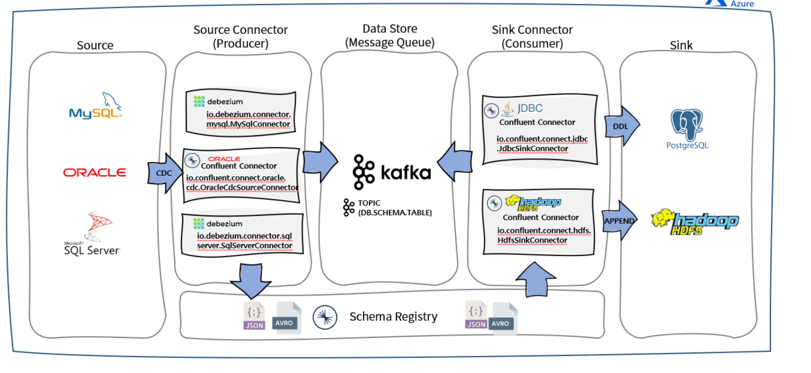

# 5주차 Airflow Deepdive 2 

다양한 DAG 실행 방법들은 이후에 다룸. 
- DAG 가 끝나면 명시적으로 다른 DAG 를 트리거링 하는 것.
- 특정한 파일이 생기면 그때 DAG 를 실행하는 것.

Airflow 와 알람 연결 
- Slack 과 같은 것들.

Redshift 에 있는 테이블 <-> 구글 스프레드 시트의 연결

이번주 내용 
- 4주차 숙제 리뷰 
- MySQL 테이블 복사 
- How to Backfill in airflow 
- Summary Table 구현

드라이버 드리븐 개념 
- 트리거를 하는 건 드라이버, 트리거를 당하는 건 드리븐

자원의 사용률을 Utilization 이라고 하구나.

## 질문 정리  

CDC (Change Data Capture)



- 관계형 DB 에서 변경사항을 일괄적으로 캡쳐해오는 것. 실시간으로 변경되는 데이터들을 캡쳐해와서 파이프라인으로 쓰는 것. 
- 데이터를 추출해서 다른 데이터베이스로 옮기는 작업을 한다면 ETL 보다는 CDC 가 나을 수도 있다고 한다. CDC 를 쓸 땐 주로 트랜잭션 로그 기반으로 하는데 이게 DB 에 부하를 주지 않으니까 .
  - 주로 online mode 에서 추출할 때는 이런 방식이 나을 수 있겠다. 배치에서 ETL 을 하는 것보다. 
- ETL 로 옮기는게 일반적

Airflow 의 환경 설정 변수들 

- Airflow 의 환경 설정이 들어간 변수는? `airflow.cfg`
- Airflow 를 API 형태로 외부에서 변경하고 싶다면 API 섹션의 auth_backend 를 airflow.api.auth.backend.basic_auth 로 변경해야한다.
  - airflow 를 REST API 형태로 조작하고 싶은 것. airflow 는 API 로 워크플로우를 조작할 수 있고 이를 보안상의 이유로 API 에 인증 매커니즘을 추가해라 라는 뜻. 
- Variable 에서 변수 값이 encrpyt 하게 되려면 변수 이름에 어떤 것들이 포함되어있어야 하는가? 
  - password, secret, passwd, authorization, apikey, api_key, access_token
- 환경 설정을 바꾸고 이를 적용하려면 해야할 것은? 
  - `sudo systemctl restart airflow-scheduler`
  - `sudo systemctl restart airflow-webserver`
- DAGs 폴더에 새로운 DAG 를 추가하면 Airflow 는 이를 알게되는데 여기서 스캔 주기를 결정하는 파일의 이름은? `dag_dir_list_interval`
  - 기본적으로 5분.
  - dags 폴더는 기본적으로 `/var/lib/airflow/dags` 에 저장된다. 

- Airflow 는 어떻게 DAG 를 찾을까? 
  - dags 폴더를 뒤지고 해당 코드가 파이썬이라면 `from airflow import DAG` 가 들어있는 코드를 찾는다. 
  - 그럼 거기에 있는 DAG 메인 코드를 실행함 (DAG 로 생성한 블락.) 
 
## MySQL 테이블에서 Redshift 에 복사하기

크게 두 가지 방법 


편리한 Operator 들이 많다. 


코드는 다음과 같다. 

```python
from airflow import DAG
from airflow.operators.python import PythonOperator
from airflow.providers.amazon.aws.transfers.sql_to_s3 import SqlToS3Operator
from airflow.providers.amazon.aws.transfers.s3_to_redshift import S3ToRedshiftOperator
from airflow.models import Variable

from datetime import datetime
from datetime import timedelta

import requests
import logging
import psycopg2
import json


dag = DAG(
    dag_id = 'MySQL_to_Redshift',
    start_date = datetime(2022,8,24), # 날짜가 미래인 경우 실행이 안됨
    schedule = '0 9 * * *',  # 적당히 조절
    max_active_runs = 1,
    catchup = False,
    default_args = {
        'retries': 1,
        'retry_delay': timedelta(minutes=3),
    }
)

schema = "keeyong"
table = "nps"
s3_bucket = "grepp-data-engineering"
s3_key = schema + "-" + table

mysql_to_s3_nps = SqlToS3Operator(
    task_id = 'mysql_to_s3_nps',
    query = "SELECT * FROM prod.nps",
    s3_bucket = s3_bucket,
    s3_key = s3_key,
    sql_conn_id = "mysql_conn_id",
    aws_conn_id = "aws_conn_id",
    verify = False,
    replace = True,
    pd_kwargs={"index": False, "header": False},    
    dag = dag
)

s3_to_redshift_nps = S3ToRedshiftOperator(
    task_id = 's3_to_redshift_nps',
    s3_bucket = s3_bucket,
    s3_key = s3_key,
    schema = schema,
    table = table,
    copy_options=['csv'],
    method = 'REPLACE',
    redshift_conn_id = "redshift_dev_db",
    aws_conn_id = "aws_conn_id",
    dag = dag
)

mysql_to_s3_nps >> s3_to_redshift_nps
```

### MySQL 에서 증분 업데이트 (Incremental Update) 를 지원하려면 

다음과 같은 필드들이 있어야한다. 
- CreatedAt (Option)
- Modified: 
- Deleted: 레코드를 삭제하지 않고, deleted 플래그를 이용 


```python
from airflow import DAG
from airflow.operators.python import PythonOperator
from airflow.providers.amazon.aws.transfers.sql_to_s3 import SqlToS3Operator
from airflow.providers.amazon.aws.transfers.s3_to_redshift import S3ToRedshiftOperator
from airflow.models import Variable

from datetime import datetime
from datetime import timedelta

import requests
import logging
import psycopg2
import json

dag = DAG(
    dag_id = 'MySQL_to_Redshift_v2',
    start_date = datetime(2023,4,20), # 날짜가 미래인 경우 실행이 안됨
    schedule = '0 9 * * *',  # 적당히 조절
    max_active_runs = 1,
    catchup = True,
    default_args = {
        'retries': 1,
        'retry_delay': timedelta(minutes=3),
    }
)

schema = "keeyong"
table = "nps"
s3_bucket = "grepp-data-engineering"
s3_key = schema + "-" + table       # s3_key = schema + "/" + table


mysql_to_s3_nps = SqlToS3Operator(
    task_id = 'mysql_to_s3_nps',
    # 달라진 점 {{ 변수 }} 를 통해서 airflow 의 실행 변수에 접근할 수 있다.
    query = "SELECT * FROM prod.nps WHERE DATE(created_at) = DATE('{{ execution_date }}')",
    s3_bucket = s3_bucket,
    s3_key = s3_key,
    sql_conn_id = "mysql_conn_id",
    aws_conn_id = "aws_conn_id",
    verify = False,
    replace = True,
    pd_kwargs={"index": False, "header": False},    
    dag = dag
)

s3_to_redshift_nps = S3ToRedshiftOperator(
    task_id = 's3_to_redshift_nps',
    s3_bucket = s3_bucket,
    s3_key = s3_key,
    schema = schema,
    table = table,
    copy_options=['csv'],
    redshift_conn_id = "redshift_dev_db",
    # replace => upsert 로 수정 
    method = "UPSERT",
    # upsert 하는 기준. 
    upsert_keys = ["id", "created_at"],
    dag = dag
)

mysql_to_s3_nps >> s3_to_redshift_nps
Footer
© 2023 GitHub, Inc.
Footer navigation
Terms
Privacy
```

## Airflow 에서 Backfill 


- `-s` 는 startdate, `-e` 는 enddate 를 말한다. 

backfill 에서 주의할 점 
- full refresh 를 지원한다면 필요없다.
- 큰 데이터의 경우라면 필요. 
- 데이터 소스에서의 도움이 필요하다. backfill 을 하기 위해서.  
- start_date 와 end_date 로 backfill 날짜를 선정할 수 있어야함.
- execution_date 를 통해서 backfill 하는 시점을 결정
- 멱등성을 보장해야함

## 요약 테이블 작성 

```python
from airflow import DAG
from airflow.operators.python import PythonOperator
from airflow.models import Variable
from airflow.hooks.postgres_hook import PostgresHook
from datetime import datetime
from datetime import timedelta

from airflow import AirflowException

import requests
import logging
import psycopg2

from airflow.exceptions import AirflowException

def get_Redshift_connection():
    hook = PostgresHook(postgres_conn_id = 'redshift_dev_db')
    return hook.get_conn().cursor()


def execSQL(**context):

    schema = context['params']['schema'] 
    table = context['params']['table']
    select_sql = context['params']['sql']

    logging.info(schema)
    logging.info(table)
    logging.info(select_sql)

    cur = get_Redshift_connection()

    sql = f"""DROP TABLE IF EXISTS {schema}.temp_{table};CREATE TABLE {schema}.temp_{table} AS """
    sql += select_sql
    cur.execute(sql)

    cur.execute(f"""SELECT COUNT(1) FROM {schema}.temp_{table}""")
    count = cur.fetchone()[0]
    if count == 0:
        raise ValueError(f"{schema}.{table} didn't have any record")

    try:
        sql = f"""DROP TABLE IF EXISTS {schema}.{table};ALTER TABLE {schema}.temp_{table} RENAME to {table};"""
        sql += "COMMIT;"
        logging.info(sql)
        cur.execute(sql)
    except Exception as e:
        cur.execute("ROLLBACK")
        logging.error('Failed to sql. Completed ROLLBACK!')
        raise AirflowException("")


dag = DAG(
    dag_id = "Build_Summary",
    start_date = datetime(2021,12,10),
    schedule = '@once',
    catchup = False
)

execsql = PythonOperator(
    task_id = 'execsql',
    python_callable = execSQL,
    params = {
        'schema' : 'keeyong',
        'table': 'channel_summary',
        'sql' : """SELECT
	      DISTINCT A.userid,
        FIRST_VALUE(A.channel) over(partition by A.userid order by B.ts rows between unbounded preceding and unbounded following) AS First_Channel,
        LAST_VALUE(A.channel) over(partition by A.userid order by B.ts rows between unbounded preceding and unbounded following) AS Last_Channel
        FROM raw_data.user_session_channel A
        LEFT JOIN raw_data.session_timestamp B ON A.sessionid = B.sessionid;"""
    },
    dag = dag
)
```
